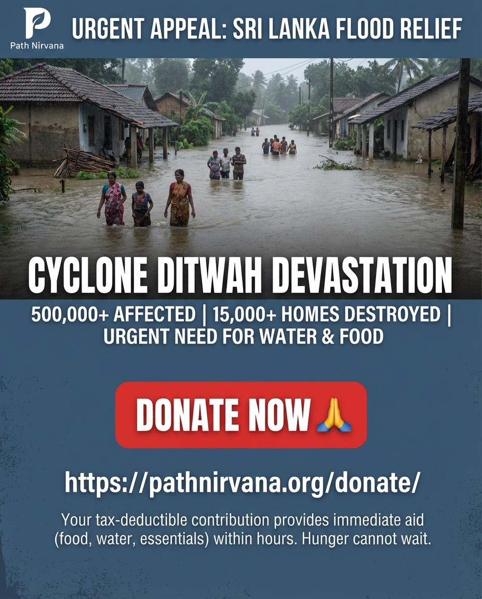

+++
title = 'Sri Lanka Flood & Landslide Relief 2025'
date = 2025-11-30T09:10:45+07:00
draft = false
+++

Over the last few days, Sri Lanka has grappled with a catastrophic disaster. Cyclonic storm Ditwah has wreaked havoc across the island, causing massive floods and landslides.

As of November 29th, the devastation is heartbreaking:
* 153 people have been confirmed dead.
* 191 are missing, with many feared buried in mudslides.
* Over 500,000 people have been directly affected.
* 15,000 homes have been destroyed.

Authorities have declared an "unprecedented disaster situation" in the Western Province due to rising water levels in the Kelani and Attanagalu rivers. Currently, 78,000 displaced people are sheltering in nearly 800 relief centers (mostly schools). Tragically, most of these centers lack basic necessities like drinking water, proper sanitation, and cooking facilities.

We need to act now.

We are committed to fulfilling these urgent needs based on the contributions we receive from compassionate individuals like you. Hunger and thirst cannot wait for leisurely discussions or administrative delays. Therefore, every dollar you contribute will be used within hours of receipt to prepare food, water, and essential supplies for the displaced.

All donations are tax-deductible.
Please click the link below to make your kind donation. [Donate](/donate)
Thank you for your generosity. 🙏