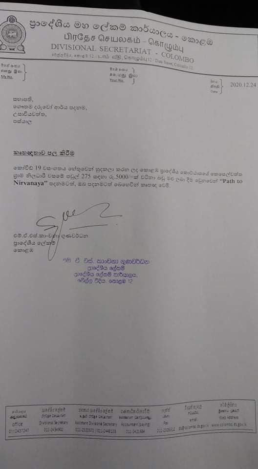

+++
title = 'Help Poor Families cope with the Virus outbreak'
date = 2020-04-14T12:05:38+07:00
draft = false
+++

As a result of the lockdown and curfew imposed by various local governments in South Asia many of the families who had non-regular jobs are out of work unable to buy food and medicine. We are coordinating with various local Sri Lankan organizations in the ground to provide necessary groceries directly to the most needed neighborhoods. Some photos from one of the projects that was recently completed are posted below.

Our organization is run by volunteers and 100% of your tax deductible donation will go to the hands of the poor as food and medicine. We have lot of experience working with Sri Lankan charity groups and as a Buddhist organization with high moral standard we take our responsibly with your donation very seriously.

You can make a tax deductible [donation here via Paypal or send us a check](/donate).

*Above photos from one of the projects we helped fund*

You can also [contact us](/about) to learn more about our projects.

### Update 12/31/2020
We donated 7500 USD worth of dry goods to the poor families in the Kurunduwatta area in Colombo, Sri Lanka who have lost their jobs due to lockdowns. Please check some of the photos below.

### Update 5/18/2020
We have donated food items to 300 families in the Mirigama area through one of our local organizations “Gautama Daruwo Arya Foundation” costing a total of 591,500 Rs or 3,150 USD. Some of the photos from this donation can be seen below.

