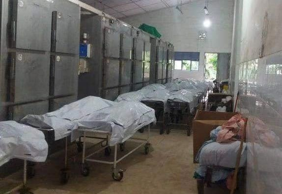
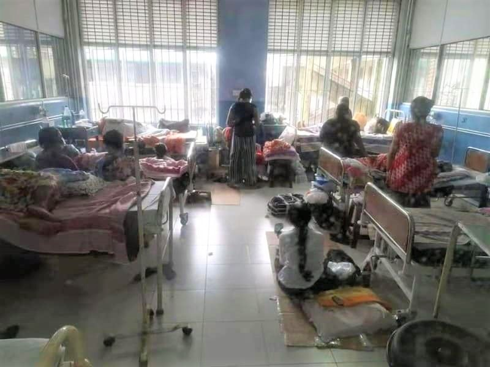
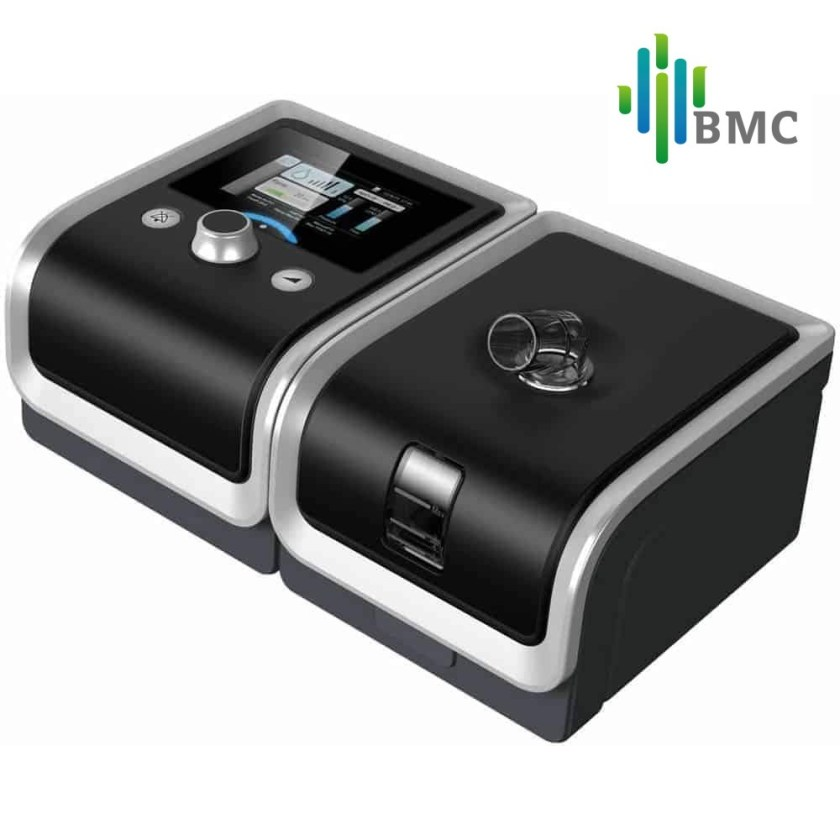
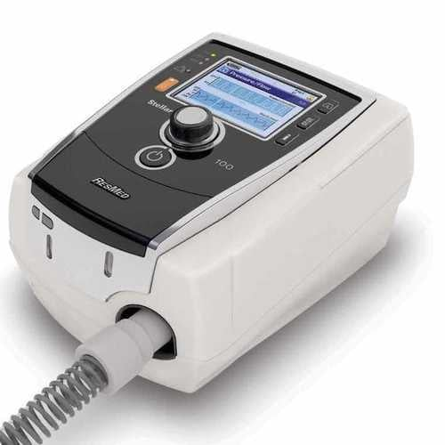

+++
title = 'COVID crisis in Sri Lankan Hospitals'
date = 2021-08-25T11:37:42+07:00
draft = false
+++

Path Nirvana Foundation (USA) and Kalana Mithuro Organization (France) have worked together with Sri Lankan doctors and hospitals to compile a list of essential medical equipment. These items would be used to help vulnerable COVID victims like pregnant mothers. The two foundations have formed a way to purchase and ship this equipment to Sri Lanka. The cost of these items are really high. So we urge all supporters to help us in this cause.

Please visit our [Donate page](/donate) to make a donation for these medical equipment during this most needed moment. Our foundation is run by volunteers and hence 100% of your donation goes towards the medical equipment purchase.

In addition you are welcome to visit our [Facebook fundraiser page](https://www.facebook.com/donate/136449685321578/).



Video below from Dr Ranjula explains the situation in Sri Lankan hospitals and which types of medical equipment are most needed at the moment.

