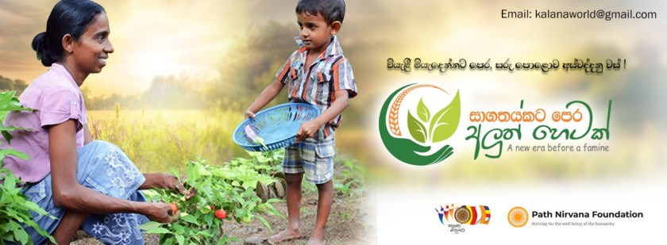

+++
title = 'Promote Home Gardens'
date = 2022-06-22T16:54:23+07:00
draft = false
+++

To face the current food crisis in Sri Lanka we have started a Home garden project. As the initial kick start we have donated plants, seeds and compost to 1,000 families. These were donated to 28 urban areas in Dehiwala and Ratmalana.

Continuous monitoring and support for these families will be done through 5 officials per urban area (Grama Seva Officer, Economic Dev Officer, Agriculture Officer and two Trainees). Officials will visit each home garden and provide guidance. The families can reach out for help and guidance through WhatsApp groups created for each area. Additionally the coordination of the activities will be done through a full time staff member based at Sahana Udaya Elders Home in Attidiya (No.28 D.S. Kahawita Lane, Attidiya, Dehiwala, Tel: 011-2761-832).

We plan to expand this project to 3,000 home gardens in urban areas over the next three months. Please visit our [Donate](/donate) page to make a donation for this program. Our foundation is run by volunteers and hence 100% of your donation goes towards the funding this project.