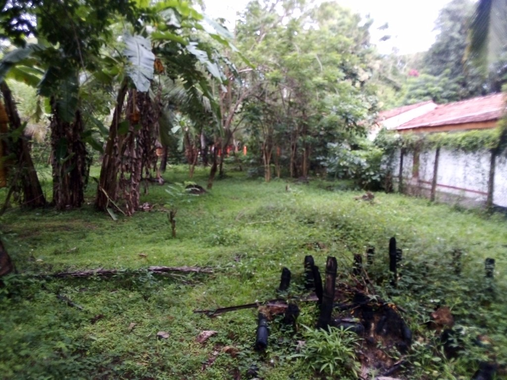
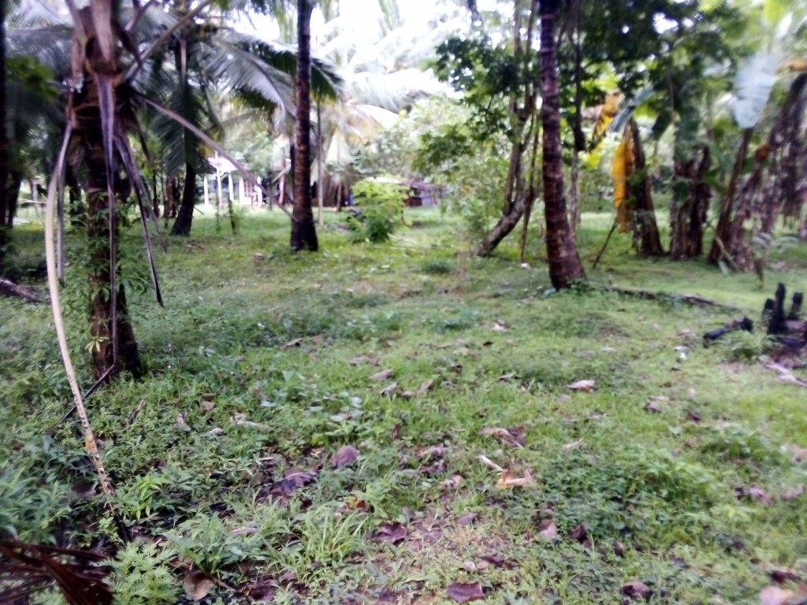
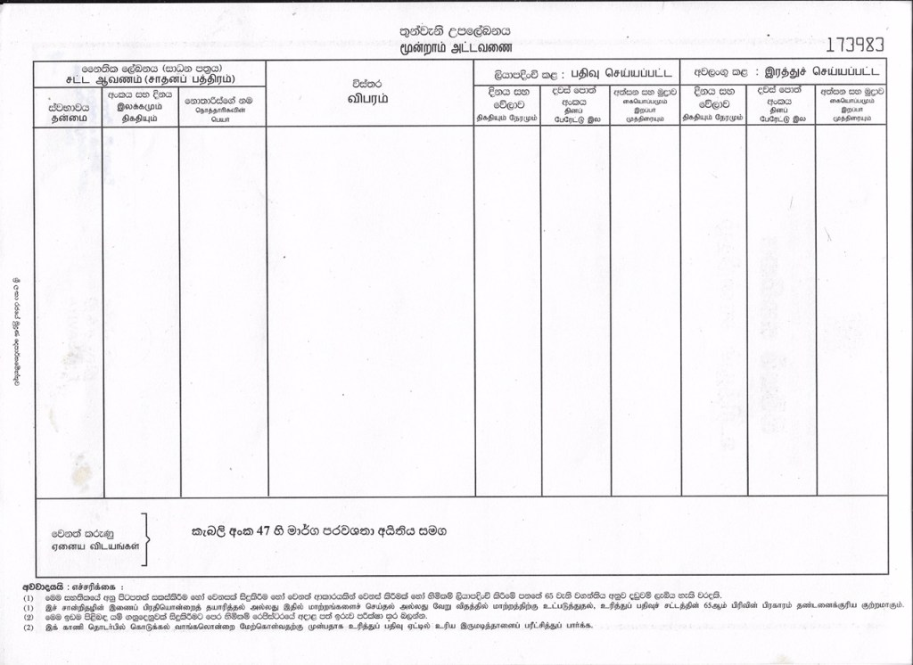
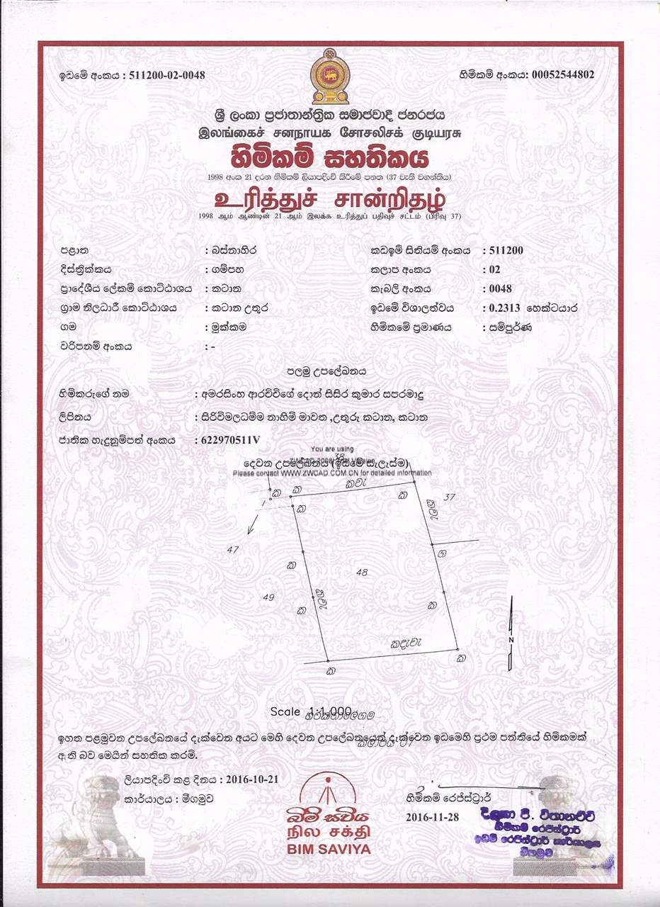
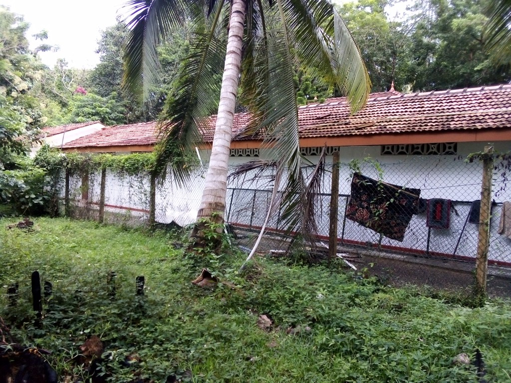

+++
title = 'Land extension to facilitate Pariyatthi Project in Katana'
date = 2019-10-10T12:19:13+07:00
draft = false
+++

We have decided to support the following project to buy a land for building a Pariyatti center. You can donate to buy at least one perch (50,000 LKR or just 275 USD). Following is the letter explaining the project.

Dear Path Nirvana Foundation

**Regarding proposed land extension for facilitate Pariyatthi Project in Katana.**

Katana Sri Gangārāma Vipassanā Meditation center [located here](https://goo.gl/maps/KcFyNfwoDv92) is an affiliated monastery to the Sri Kalyānī Yogasrama Samstha. This monastery will be the main residence of the Sri Lankan monks led by Ven Werapitiye Dewananda, Ven Watagoda Maggavihārī Theros who are currently studying in Myanmar. 

We are intending to use this place as the base to make our institutional plans and manage project developments about the future Dhamma Institution, most probably, in Kaluwaragaswewa Divisional Secretariat Portal, near Anamaduwa. As initiation the qualified monks will be gathered here and according to curriculum, the text books will be prepared for the upcoming Pariyatti & Bhikkhu training program. As for our experience and understanding, we have chosen this location as it meets easy access for both monks and lay devotees who provide and gain support and services. 

This place also the most suitable place for our digital Dhamma works such as editing the digital version of the Tipitaka and conserving, the e-books related to Dhamma and recording online Dhamma tutoring projects. We have an intention to equip this monastery with modern technologies and equipment in our quest of propagating Dhamma into the modern world, especially in English. Hence, should have to provide more accommodation for monks and novices in the time to come. However, the limited present monastic land which has spread only within 3/4 acres seems not adequate enough to support our intended plans. This obstacle can be overcome by adding this appropriate land property (comprising 90 Perches), which is available for the monastery purpose for cooperative price, to the present land hoping to fully facilitate required proposals and accommodate more monks. I, here by, sincerely inform you that this would be appropriate lodging-place, for the centre and for present works.

The cost of the land ( 90 perches) is 4.5 Million . We believe it’s a reasonable price considering the land is  situated right next to the monastery at Katana. The owner wishes to finalize the sale immediately and appreciate if we can do the transaction as soon as possible.  
I take this opportunity to thank you and everyone who is supporting this Noble project 

Here are some photos of the proposed land including the deed of the land

Update: We have sent 2 Million LKR for this project and the land purchase was done by the Katana Temple