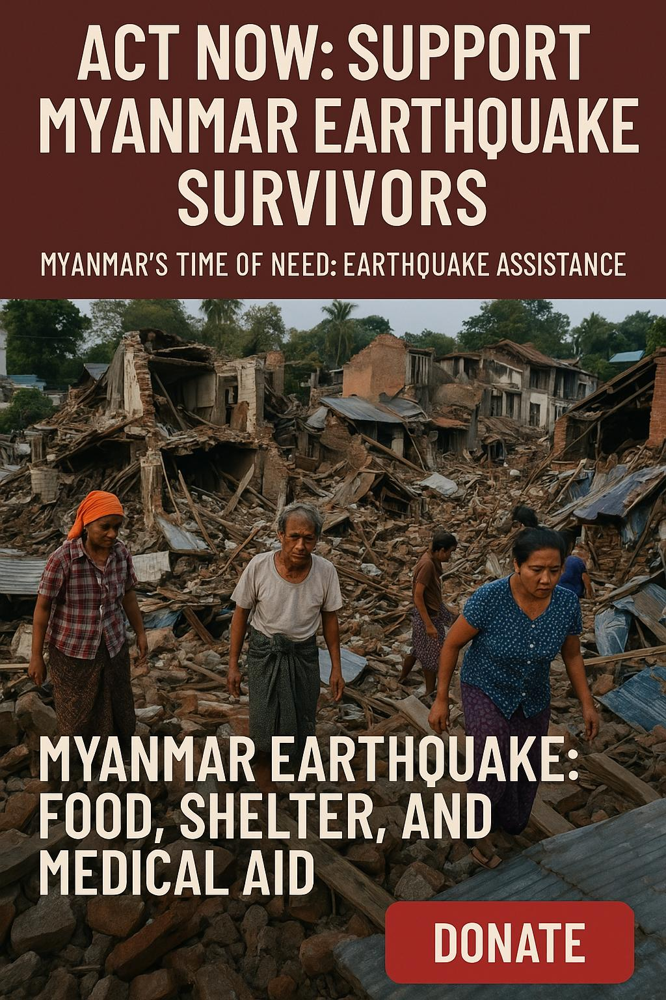

+++
title = 'Myanmar Earthquake Relief'
date = 2025-04-06T09:10:45+07:00
draft = false
+++

Let’s Show Gratitude to Myanmar in Their Time of Need

The recent earthquake in Myanmar has left many devastated—without food, shelter, or safety. Though we once offered Dhamma to Myanmar, today, it is Myanmar that has helped us preserve and restore the pure teachings of the Buddha in Sri Lanka. Now is the time to express our deep gratitude.

Many temples and homes have collapsed. Families are left homeless and vulnerable. Though some Sri Lankan temples are stepping in, logistical delays mean help often arrives too late.

We, a group that has been supporting monasteries and poor communities around Mandalay for several years, are in a position to respond swiftly. Our plan is to purchase essential food and medicine from Yangon and distribute them directly to the affected people—without delay.

This is not enough. The need is far greater. Your help can bring real, immediate relief.

If you and your family were suddenly left without food, water, or shelter—what would you hope for?

Now is the moment to act. Let us give with compassion and earn merit that supports us not just in this life, but throughout the cycle of rebirth. May no one suffer as these people are suffering now.

If funds remain after emergency relief, they will go toward rebuilding essential housing and temples.

Every donation counts. Please give what you can: [Donate](/donate)

May the blessings of the Triple Gem be with you.